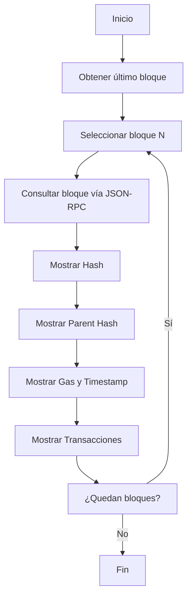
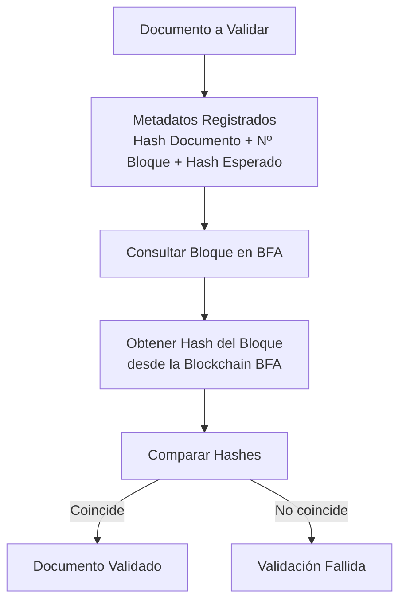

# US21-Blockchain
Repo para los desarrollos relacionados al proyecto de investigación de blockchain

# Objetivo
Desarrollar software que tome documentos y los valide contra una blockchain donde se haya guardado su hash.

# Metodología
El PoC consta de dos scripts en python, que deben ser ejecutados en una terminal:

- NavegarBloques.py consulta los últimos bloques y muestra su información

- ComprobarHash.py valida que un hash existe en un cierto bloque, permitiendo así comprobar que un documento no fue modificado luego de guardar su hash en la blockchain

Este software usa la testnet de BFA, validando contra la API pública en el endpoint http://public.test2.bfa.ar:8545, obtenido de la documentación del proyecto BFA.

# Requerimientos
Sólo requieren la librería requests, que puede ser instalada mediante
$ python -m pip install requests
